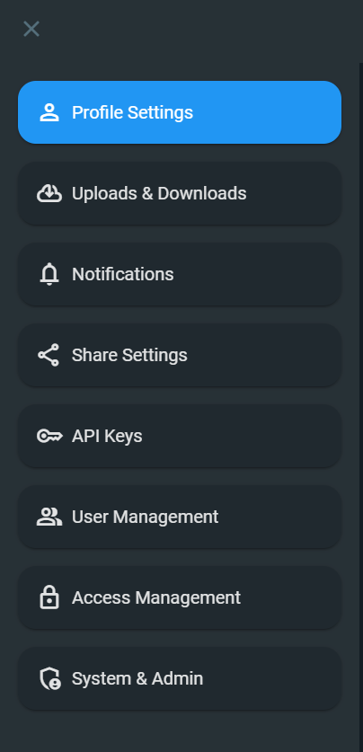
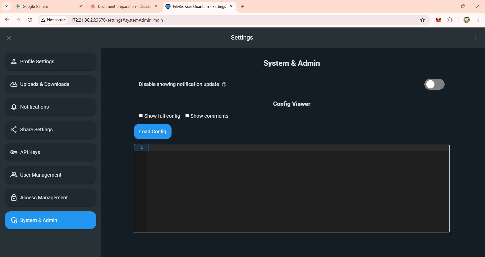
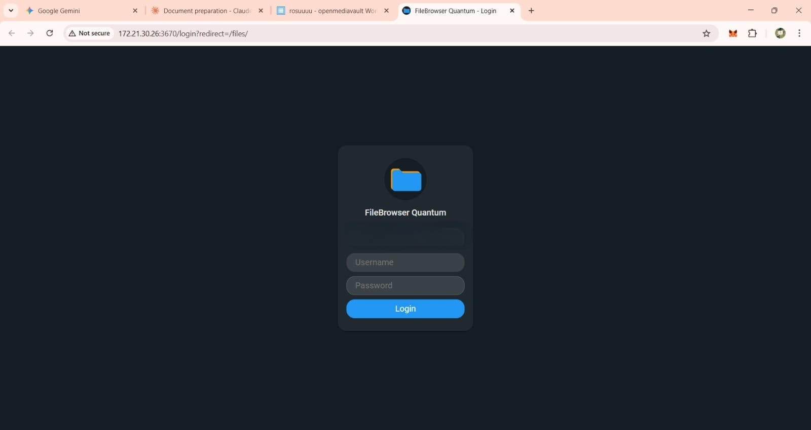
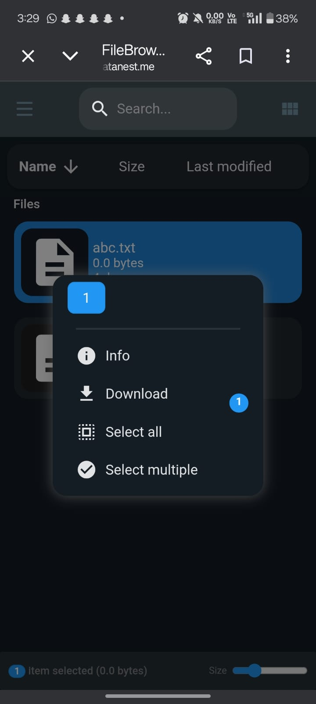

# Secure Home NAS with Cloudflare Zero Trust & Media Streaming

A self-hosted private cloud and media server built on a Raspberry Pi,
designed to provide secure remote file access and media streaming
without exposing the home network through traditional port forwarding.

## Project Overview

The system combines:

-   **Raspberry Pi** --- server hardware
-   **Raspberry Pi OS Lite** --- lightweight server OS
-   **OpenMediaVault (OMV)** --- NAS and storage management
-   **LUKS** --- encryption for data at rest
-   **FileBrowser Quantum** --- browser-based file management
-   **Podman** --- container runtime
-   **Cloudflare Tunnel / Zero Trust** --- secure remote access without
    inbound port forwarding
-   **Cloudflare DNS** --- domain routing
-   **Jellyfin** --- private media streaming
-   **Role-Based Access Control (RBAC)** --- separate read-only and
    read/write users

## Architecture

``` text
                         Internet
                            |
                    HTTPS / Domain
                            |
                  Cloudflare Zero Trust
                            |
                  Cloudflare Tunnel
                  (Outbound from Pi)
                            |
                     Raspberry Pi
                            |
                +-----------+-----------+
                |                       |
          FileBrowser                Jellyfin
           Port 3670                Port 8096
                |                       |
                +----------+------------+
                           |
                    Shared Storage
                           |
                    LUKS Encryption
                           |
                       EXT4 Disk
```

## Main Objective

The goal was to create a private cloud-like storage system that could be
accessed remotely while keeping the home network protected.

Instead of opening router ports for remote access, the Raspberry Pi
establishes an outbound connection to Cloudflare. Remote requests are
authenticated and routed through the existing tunnel.

## How the System Works

### 1. NAS Layer

OpenMediaVault provides the management layer for storage, users, shared
folders, and network services.

### 2. Storage Security

The storage drive is protected using LUKS encryption. This protects data
at rest if the physical storage device is removed or stolen.

### 3. File Management

FileBrowser provides a web interface for uploading, downloading,
deleting, renaming, and organizing files.

The project used separate users:

-   `public_user` --- read-only access
-   `private_user` --- read/write access

### 4. Remote Access

Cloudflare Tunnel replaces traditional router port forwarding.

``` text
User
  |
  v
https://<your-domain>
  |
  v
Cloudflare
  |
  v
Secure Tunnel
  |
  v
Raspberry Pi
  |
  v
FileBrowser
```

No inbound router port is required for the tunnel connection.

### 5. Media Streaming

Jellyfin is connected to the media storage and provides private
streaming functionality.

``` text
File uploaded
      |
      v
Encrypted NAS storage
      |
      v
Jellyfin scans media
      |
      v
User streams media
```

Jellyfin is configured with read-only access to the media directory so
the media server can read files without modifying or deleting the
original uploads.

## Security Layers

  Layer                   Technology                 Purpose
  ----------------------- -------------------------- --------------------------------
  Data at rest            LUKS                       Protects stored data
  Remote access           Cloudflare Tunnel          Avoids inbound port forwarding
  Authentication          FileBrowser / Cloudflare   Controls user access
  Authorization           RBAC                       Limits user permissions
  Transport               HTTPS through Cloudflare   Encrypts remote traffic
  Application isolation   Podman                     Runs services in containers

## Project Challenges

During implementation, the main troubleshooting areas included:

-   Network connectivity problems after OpenMediaVault installation
-   Wi-Fi configuration conflicts
-   Temporary connectivity recovery using USB tethering
-   DNS propagation while moving nameservers to Cloudflare
-   Cloudflare SSL and tunnel configuration
-   Cloudflare access/WAF rules blocking requests
-   Integrating FileBrowser storage with the encrypted partition
-   Connecting Jellyfin to the same media storage
-   Maintaining correct user permissions

## Important Design Decisions

### Why Raspberry Pi?

It is compact, low-power, inexpensive, and suitable for running a small
always-on home server.

### Why OpenMediaVault?

It provides a web-based management layer for NAS storage, users, shared
folders, and services instead of requiring everything to be configured
manually from the command line.

### Why LUKS?

LUKS provides encryption at rest. It addresses a different threat from
network security: if the physical drive is stolen, the stored data
remains encrypted without the unlock passphrase.

### Why Cloudflare Tunnel?

Traditional remote NAS access often uses router port forwarding. The
tunnel uses an outbound connection from the NAS to Cloudflare, reducing
the need to expose inbound services directly to the internet.

### Why Podman?

FileBrowser and Jellyfin can run in containers, giving service isolation
and easier deployment. The project also uses rootless/container-oriented
operation for improved security.

### Why Jellyfin?

It turns the NAS into a private media server so stored videos can be
streamed rather than manually downloaded.

## Screenshots

### FileBrowser Settings



### FileBrowser System & Admin



### FileBrowser Login



### Mobile File Access



## Example Cloudflare Tunnel Configuration

The repository contains a safe example configuration in:

`config/cloudflared/config.example.yml`

Replace the placeholders with your own tunnel ID, credentials path,
domain, and local services.

## Project Structure

``` text
secure-home-nas/
├── README.md
├── .gitignore
├── LICENSE
├── config/
│   └── cloudflared/
│       └── config.example.yml
├── docs/
│   ├── architecture.md
│   ├── security.md
│   └── deployment-notes.md
└── screenshots/
    ├── 01-filebrowser-settings.png
    ├── 02-filebrowser-system-admin.png
    ├── 03-filebrowser-login.png
    └── 04-mobile-file-access.png
```

## Security Note

Do **not** upload any of the following to GitHub:

-   Cloudflare tunnel credential JSON files
-   `cert.pem`
-   passwords
-   API tokens
-   SSH private keys
-   private configuration files containing secrets
-   personal `.env` files

Use example configuration files with placeholders instead.

## Future Improvements

Possible extensions include:

-   Automated backups
-   Monitoring with Prometheus and Grafana
-   Multi-factor authentication
-   Automatic encrypted backup to another storage device
-   More granular access policies
-   Health monitoring and alerting
-   Automatic service recovery after reboot

## Skills Demonstrated

**Linux • Raspberry Pi • OpenMediaVault • LUKS • Podman • Cloudflare
Zero Trust • DNS • HTTPS • RBAC • FileBrowser • Jellyfin • Storage
Administration • Network Security**

## License

MIT License. See `LICENSE`.
